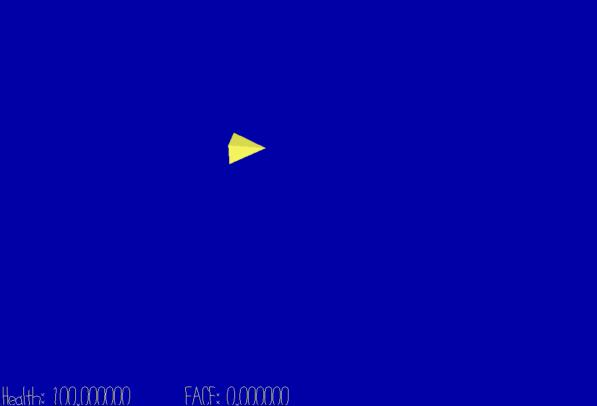

# EGBDF: Every Galactic Bell Disrupts Flight

Author: Kenechukwu Echezona

Design: A flying sidescrolling where the player dodges explosions time to bell chimes.

Known bugs:
- Asset pipeline is kinda broken (it seems I can convert my charts to a runtime format, but reading them causes problems with the strings). I deliberately added an extra t to the chart name so the game would run.

Screen Shot:

How To Play:
- WASD: Move
- Listen for the bell chimes: they tell you the location of a Chime Bomb that will explode in four beats (one measure).
- Your goal is to avoid the explosions and survive to the end of the song.

Strategies and Advanced Play:
- Make a mental map of the Chime Bombs as you hear them, and preemptively avoid those areas even before the visual cue shows up.
- Having trouble dodging? Focus on the more complex melodic ideas rather than the basslines or ostenatos.
- Think you know the stage well? Prove your mastery with a high FACE Score! FACE stands for "Flying A-lotta Close to Explosions."

This game was built with [NEST](NEST.md).
